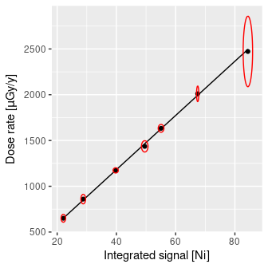

<!-- README.md is generated from README.Rmd. Please edit that file -->

# gamma 

[](https://github.com/crp2a/gamma/actions)
[](https://codecov.io/gh/crp2a/gamma)

[](https://cran.r-project.org/package=gamma)
[](https://cran.r-project.org/web/checks/check_results_gamma.html)
[](https://cran.r-project.org/package=gamma)

[](https://www.repostatus.org/#wip)
[](https://www.tidyverse.org/lifecycle/#experimental)

[](https://doi.org/10.5281/zenodo.2652393)

## Overview

**gamma** is intended to process in-situ gamma-ray spectrometry
measurements for luminescence dating. This package allows to import,
inspect and (automatically) correct the energy scale of the spectrum. It
provides methods for estimating the gamma dose rate by the use of a
calibration curve. This package only supports Canberra CNF and TKA
files.

The [**gammaShiny**](https://github.com/crp2a/gammaShiny) package
provides an exhanced graphical user interface for the main applications
of **gamma**.

## Installation

Install the development version from GitHub with:

``` r
# install.packages("remotes")
remotes::install_github("crp2a/gamma")
```

## Usage

``` r
## A minimal example
## You may want to give extra attention to the energy calibration step
library(gamma)
library(magrittr)

## Find the full path to the spectrum file
spc_file <- system.file("extdata/LaBr.CNF", package = "gamma")
## Import the spectrum
spectrum <- read(spc_file)

## Set the expected chanel/energy peaks for the energy scale calibration
## Spectrum pre-processing and peak detection
peaks <- spectrum %>%
  slice_signal() %>%
  stabilize_signal(transformation = sqrt) %>%
  smooth_signal(method = "savitzky", m = 21) %>%
  remove_baseline() %>%
  find_peaks()

## Set the energy values (in keV)
set_energy(peaks) <- c(238, NA, NA, NA, 1461, NA, NA, 2615)

## Calibrate the energy scale
calib <- calibrate_energy(spectrum, peaks)

## Inspect peaks
plot(calib, peaks)
```


``` r
## Load the calibration curve for the dose rate estimation
## As this curve is instrument specific, you will have to build your own
## See help(fit_dose)
data("BDX_LaBr_1", package = "gamma")
plot(BDX_LaBr_1)

## Estimate the gamma dose rate
(doses <- predict_dose(BDX_LaBr_1, calib))
#>   names  dose_Ni error_Ni dose_NiEi error_NiEi
#> 1  LaBr 4171.876 92.54298  3944.501   78.27257
```

<!-- -->

## Contributing

Please note that the **gamma** project is released with a [Contributor
Code of
Conduct](https://github.com/crp2a/gamma/blob/master/.github/CODE_OF_CONDUCT.md).
By contributing to this project, you agree to abide by its terms.

## Acknowledgements

This work received a state financial support managed by the Agence
Nationale de la Recherche (France) throught the program *Investissements
d’avenir* (ref. [10-LABX-0052](https://lascarbx.labex.u-bordeaux.fr) and
[11-IDEX-0001](https://amidex.univ-amu.fr)).
